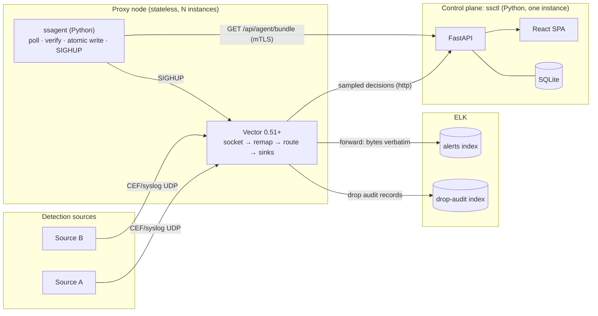
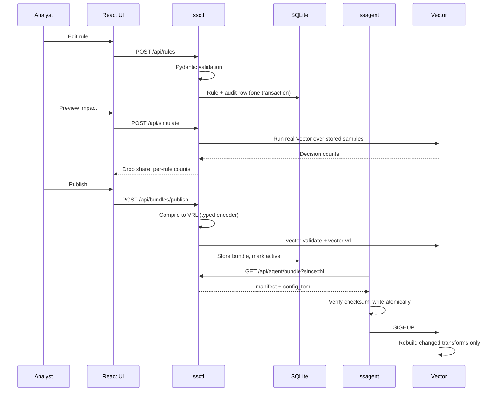

# Architecture and implementation approach

**Status:** Implemented · **Owner:** Yurii · **Date:** July 31, 2026
**Decisions:** [decisions.md](decisions.md) · **Terms:** [glossary.md](glossary.md)
**Stack:** Python backend, React frontend, Vector data plane
**Style:** Microsoft Writing Style Guide

## The shape of the system

Two planes with a hard boundary between them.



**The one property that matters most:** the control plane is not in the data path. If `ssctl`
is down, nodes keep forwarding from their cached bundle indefinitely. Losing the UI must never
lose an event.

Everything else follows from that. Sampling happens at the node, not in Python. The tail sink
drops rather than blocks. The agent runs from cache on any fetch failure. The node starts in
forward-everything mode if it has never seen a bundle.

## Why the data plane is not Python

CPython cannot do per-packet UDP work at the D-21 targets (20,000 EPS sustained, 100,000 burst,
under 1 ms at p99). The global interpreter lock caps single-process throughput, per-object
allocation costs on every field, and garbage collection pauses land in the p99 budget.

So Python goes where Python is strong: the API, the data model, the compiler, and the web app.
Vector handles the event path. This is not a compromise around the stack. It is the correct
reading of it, and it is why the layer split is structural rather than stylistic.

## Request paths

### Rule change to running config



### Event path

One remap transform decides, one route splits, three sinks consume. The event never leaves
Vector.

```
socket(udp) ─► remap "decide" ─► route "split" ─┬─ forward ──► socket sink ──► ELK
                     │                          └─ dropped ──► remap "audit" ──► drop-audit
                     └─► sample ──► remap "tail" ──► http sink ──► ssctl
```

The `sample` transform is the *only* path to the control plane. It samples forwarded events at
1 in `sample_rate` and excludes drops, where `exclude` means "always pass through" rather than
"discard". A second path for drops would double-count them; see "What the data plane taught us".

## The compiled VRL

Generated by [`compiler.py`](../src/sixthsense/compiler/compiler.py). The structure is fixed;
only the rule branches vary.

```vrl
raw = to_string(.message) ?? ""

ev = {}
parse_ok = false
syslog_ok = false
cef_ok = false
body = raw
decision = "forward"      # every variable initialized before the branches
reason = "default"

parsed, perr = parse_syslog(raw)
if perr == null {
    syslog_ok = true
    body = to_string(get(parsed, ["message"]) ?? raw) ?? raw
}

cef, cerr = parse_cef(body)
if cerr != null {
    marker = find(raw, "CEF:")          # see "What the data plane taught us"
    # `!= null` is required: find is typed integer but returns null when absent.
    if marker != null && marker >= 0 { cef, cerr = parse_cef(slice!(raw, marker)) }
}
if cerr == null { ev = cef; cef_ok = true }

ev = map_keys(ev) -> |k| { downcase(k) }   # D-07, done once

# Syslog fields get their own namespace so `severity` keeps one meaning (D-14).
if syslog_ok { ev = set!(ev, ["syslog"], map_keys(parsed) -> |k| { downcase(k) }) }

parse_ok = syslog_ok || cef_ok             # either parser is enough to decide

matched_id = null
# ... one branch per active rule, in chain order ...

if !parse_ok        { decision = "forward_parse_error"; reason = "parse_error" }
else if matched_id == null { decision = "forward";      reason = "default" }
else if matched_shadow || shadow_chain { decision = "forward"; reason = "shadow" }
else                { decision = matched_action;        reason = "rule" }

.ss = { "decision": decision, "rule_id": matched_id, "cef_ok": cef_ok, ... }
```

### The field namespace

Rules match both wire formats, and the two parsers disagree about what common names mean:

```
ev = {
  "severity": "9",              # CEF header: 0-10, higher is worse
  "filterhostname": "web-01",   # CEF extension
  "syslog": {
    "severity": "info",         # syslog: a word, and the scale is inverted
    "hostname": "web-01",
    "appname": "sshd",
  },
}
```

A dot in a rule's field name is a path separator, so `syslog.appname` addresses the nested key.
A dot in a rule's *value* is an ordinary character; only `encode_path` splits.

CEF fields stay at the top level on purpose. All ten of the field names in the task are CEF
extension keys, so namespacing them would have broken every rule to fix a problem CEF does not
have. The nesting is applied only where the collision is real.

Three deliberate properties:

- **`.message` is never assigned.** Parsing writes to `ev`, a scratch variable. The socket sink
  emits `.message` with `codec = "text"`, so ELK receives byte-identical input (D-15). This is
  the whole cutover safety argument, and there is an end-to-end test that asserts it on the wire.
- **Matching and enforcement are separate.** Shadow mode changes the enforced decision without
  changing which rule the audit trail reports (D-29).
- **Every branch assigns.** VRL scopes assignments to their block, so a variable first assigned
  inside an `if` is undefined afterward.

## The injection boundary

Compiling analyst input into VRL is the highest-risk thing this system does. An analyst typing a
quote into a rule value is a code-injection vector against our own data plane.

Every user value reaches the generated program through one module,
[`encoder.py`](../src/sixthsense/compiler/encoder.py). Four layers:

| Layer | Mechanism |
|---|---|
| Type | Only `str`, `bool`, `int`, `float`, and lists of those. Everything else raises. |
| Escaping | Strings become VRL literals with escapes; control characters become `\u{..}`. |
| Numbers | Floats render as plain decimal, never scientific notation. VRL reads `1e+17` as an identifier `1e`, so an exponent produces a program that does not compile. |
| Paths | Field names split on `.` into separately quoted segments. Values never split. |
| Regex literals | Globs compile to regex with `'` emitted as `\x27`, since a quote in any form would terminate the surrounding raw string. A second check rejects any regex containing one. |
| Embedding | `tomli_w` handles TOML escaping, so we never hand-escape the program into the config. |

Proven by a Hypothesis property that is the strongest statement of the invariant: **two different
user values produce byte-identical code once literal contents are stripped.** A value that could
change the skeleton would, by definition, be executing.

## What the data plane taught us

Six things that only surfaced by running real Vector, all of which would have shipped
otherwise. The last two arrived during a review of the first three, which is itself the point:
the fix for a bug in a delegated component is rarely the end of the story.

### `vector validate` does not compile VRL

The gate in D-44 was insufficient. `vector validate` checks config structure only. A remap
transform referencing an undefined variable passes it cleanly and then fails in the topology
builder at startup. On a node that means Vector refuses to start, the last known good config
keeps running, and the rollout silently does nothing.

`vector vrl -p <program> -i <event>` does compile, and exits 70 on error. The gate now runs both.
This is fixed in [`validate.py`](../src/sixthsense/compiler/validate.py) and the DevSecOps
document is updated.

### Null comparison is a fallible predicate

`(to_float(x) ?? null) <= 3.0` fails to compile: comparing null to a number is a runtime error,
and VRL rejects fallible predicates. An `x != null &&` guard does not help, because the type
checker cannot narrow through it. The comparison now coalesces with `?? false`, which is also the
semantics we want: a missing or non-numeric field never satisfies a threshold rule.

### `parse_syslog` eats the CEF marker

This is the one that would have been most expensive to find in production. Given
`<134>Jul 30 12:00:00 host CEF:0|Vendor|...`, `parse_syslog` treats `CEF:` as the syslog tag and
returns a message body starting at `0|Vendor|...`, which is no longer valid CEF. Every rule
silently stopped matching while events kept flowing, so nothing looked broken.

The fix locates `CEF:` in the original bytes and parses from there. This is exactly the failure
mode the research warned about: a misparse does not crash, it produces a wrong filter decision.

### `find` returns null while claiming to return an integer

The fix above introduced the worst bug of the five, and it went unnoticed through both gates.

`find(raw, "CEF:")` has a static type of `integer`. At run time it returns `null` when the needle
is absent:

```
needle absent  → runtime null, static type { "integer": true }
needle present → 26
```

So `if marker >= 0` compiles as an infallible integer comparison and then fails at run time with
`can't compare null >= integer` on **every event without a CEF marker**. The program aborts there,
before any rule branch, and `.ss` is never assigned.

The consequences ranked by how quietly they fail:

- The rule chain never evaluated for plain syslog. Rules on syslog fields could not match.
- No `forward_parse_error` was ever emitted, so D-18's "count them" was not happening.
- The tail record carried `ts: null, decision: null`, which the `DecisionRecord` model requires,
  so the control plane rejected the whole 50-event batch.
- Events still reached ELK, because `drop_on_error = false` and the `split._unmatched` route both
  fail open. **Nothing looked broken.**

The guard is `marker != null && marker >= 0`. That is the opposite of the advice two sections up,
and the distinction matters more than either fix: `?? false` is *rejected here* with E651,
"unnecessary error coalescing operation," because the checker believes the comparison cannot fail.
Use `?? false` when VRL knows an expression is fallible, and `!= null &&` when it is wrong.

### `exclude` on the `sample` transform double-counted every drop

The tail path sampled forwarded events at 1 in 100 and kept every drop, which it did by setting
`exclude = '.ss.decision == "drop"'` on the `sample` transform **and** adding a second `filter`
transform for drops, with both feeding the same remap.

`exclude` does not discard. It means "bypass sampling and always pass through". So drops already
came down the sample path, and the filter sent them a second time. One dropped event produced two
decision records with identical timestamps.

The live view showing double is cosmetic. What matters is that the same records persist to
`sample_events`, which is what the impact preview reads, so **the projected drop share was roughly
double the truth** and D-27's 5% blast-radius confirmation fired on that number. A feature meant
to stop an analyst from shipping an over-broad rule was overstating the very quantity it exists
to check.

The fix is deleting the filter. `test_a_dropped_event_is_reported_once` pins it, along with a
companion asserting forwarded events are still sampled rather than streamed, because the naive
correction — dropping `exclude` — would have sent event-rate traffic to the control plane.

### `vector vrl` exits 0 on a runtime error

This is why the bug above passed the gate, and it is the more valuable of the two findings.

`vector vrl` returns 70 for a compile error, but a **runtime** error is printed on that event's
output line and the exit code stays 0. A gate that reads the exit code cannot distinguish a
program that decided from one that crashed. The old probe was also a single CEF event, so the
non-CEF branch was never executed at all.

The gate now runs a corpus covering CEF-in-syslog, bare CEF, RFC 3164, RFC 5424, and garbage, and
requires one well-formed decision per input event. It is verified by
`test_a_runtime_abort_is_caught`, which reintroduces the exact bug and asserts the gate rejects it.

**The general lesson:** three of these five were fixed by changing one line. This one was fixed by
changing what the gate can see, and it is the only one that would have caught the others.

## Data model

Five tables in SQLite, WAL mode. Right-sized: one writer, roughly 100 rules, low write volume.
PostgreSQL is a URL change plus a migration if the control plane ever needs more than one
instance.

| Table | Purpose | Notes |
|---|---|---|
| `rules` | The chain | Never hard deleted. Disabling is the only removal path. |
| `chain_settings` | `default_action`, `shadow_mode` | One row. Admin-only to change. |
| `bundles` | Published configs | Immutable. Rollback reactivates stored bytes rather than recompiling. |
| `audit_log` | Every change | Append-only. There is no update or delete path in the API. |
| `sample_events` | Traffic sample | Bounded ring. Feeds the impact preview and offline replay. |

`sample_events` is the component that the design documents originally missed. The impact preview
and the offline replay both need persisted traffic, and the live view's in-memory ring buffer has
the wrong lifetime and the wrong size for either.

## Authorization

Enforced in FastAPI dependencies, never in React. The UI hides controls for usability; the
server is what makes them unreachable.

| Action | Minimum role |
|---|---|
| Read rules, bundles, audit, decision metadata | `viewer` |
| See event contents in the live view | `rule-editor` (redacted server-side for `viewer`) |
| Create, edit, disable rules; publish; roll back | `rule-editor` |
| Change `default_action` or chain-wide shadow mode | `admin` |

Flipping the whole system to fail-closed is deliberately not a two-click operation for a rule
editor.

The development auth bypass cannot be enabled while bound to a non-loopback interface. That is a
validator in `Settings`, not a warning in a readme, because "the development flag reached
production" is precisely what it exists to prevent.

## Deployment

| Environment | Shape |
|---|---|
| Development | `ssctl serve --reload`, Vite dev server proxying `/api` |
| Demo | `docker compose up`, with a fake ELK receiver that prints what it gets |
| Production | Two images. One control plane instance, N stateless nodes. |

Nodes need no capabilities unless you bind port 514, which requires `CAP_NET_BIND_SERVICE`. Both
images run non-root with a read-only root filesystem.

For high availability, run nodes active/passive behind a virtual IP address, sized for n−1, with
load balancer stickiness disabled. The control plane needs no HA because it is not in the data
path.

## Cutover

The riskiest moment in this system's life is the first time it sits in the live path.

1. Deploy with chain-wide **shadow mode on**. Everything forwards; the proxy records what it
   would have dropped.
2. Compare forwarded counts against the pre-insertion baseline for an agreed soak period. They
   should match exactly.
3. Review the shadow decisions with the SOC. This is where a wrong `filterpriority` assumption
   (D-08) would surface.
4. Turn shadow mode off.

Rollback is one step: point the detection source back at ELK.

Before step 1, verify that nothing downstream keys off the packet source IP address (D-16). After
insertion every packet arrives from the proxy's address. It is cheap to check and expensive to
discover late.

## Known limits

- **OpenID Connect is not implemented.** Local accounts work fully. The auth layer is structured
  for OIDC and D-34 names it as the production mode, but shipping untested auth code would be
  worse than shipping none. This is a stated gap, not a stub.
- **The 5% blast-radius confirmation is advisory in the UI.** The API reports
  `requires_confirmation`; enforcing it server-side needs a confirmation token on the publish
  call.
- **No automatic rollback.** Deliberate. See the DevSecOps document.
- **The burst target is met with four worker processes**, at zero loss and zero kernel drops.
  Measured below. The p99 figures at that rate are not trustworthy on a laptop where the load
  generator competes with what it measures, so latency at saturation still needs dedicated
  hardware.
- **A colliding CEF extension key is lost**, because `parse_cef` discards it before the compiler
  sees it. D-09 assumed otherwise and is recorded as a known gap in the decision register.
- **The decision intake endpoint shares a listener with the admin API**, which D-35 says it
  should not. The trust boundary is network segmentation, documented at the endpoint.


## Measured performance

Run with `make perf`. Numbers below are from an Apple silicon laptop with Vector, the sender,
and the receiver all competing for the same cores, so treat them as a floor.

| Target | Result |
|---|---|
| **20,000 EPS sustained** (D-21) | **Met.** 20,000 EPS processed, 0 lost, 0 kernel drops. |
| **Added p99 latency under 1 ms** (D-21) | **Met.** 376 us added (411 us through the proxy, 35 us baseline). |
| **100,000 EPS burst** (D-21) | **Met with four worker processes**, zero loss, zero kernel drops. A single process tops out near 35,000 EPS. |

The harness measures latency twice, with and without the proxy in the path, and reports the
difference. The absolute number is dominated by Python's own send and receive cost, which the
proxy is not responsible for.

### What the burst failure showed

At 165,000 EPS offered load, 238,331 of 300,000 events were lost. **The kernel drop counter
reported exactly 238,331.** That is D-24 working as designed: application counters alone would
have shown events arriving and no error, and the loss would have looked like a mystery.

The cause is visible in the same output: the harness asked for a 32 MB socket buffer and the
kernel granted 8 MB, which is macOS's `kern.ipc.maxsockbuf` default. An 8 MB buffer holds about
200 ms of burst at that rate. The harness prints the shortfall and names the sysctl.

Two honest conclusions:

1. The sustained target is met and the added latency budget has substantial headroom.
2. The burst target needs a tuned Linux host to measure properly, and it has not been. Do not
   claim it until it has.

### How it scales with CPU

Measured with `ssperf --scale 1,2,4,8`, which limits Vector's worker threads. That is the same
knob as a Kubernetes CPU limit, so the curve maps directly onto a resource request.

**Paced at the 20,000 EPS target:**

| Vector threads | Throughput | Loss | Kernel drops | p99 latency |
|---|---|---|---|---|
| 1 | 20,000 EPS | 0.00% | 0 | 649 ms |
| 2 | 20,000 EPS | 0.00% | 0 | 17 ms |
| 8 | 20,000 EPS | 0.00% | 0 | 46 ms |

**Unpaced, offered load above the ceiling:**

| Vector threads | Throughput | Scaling efficiency |
|---|---|---|
| 1 | 39,154 EPS | 100% (reference) |
| 2 | 43,158 EPS | 55% |
| 4 | 43,792 EPS | 28% |
| 8 | 41,136 EPS | 13% |

**Throughput does not scale with worker threads.** Going from 1 core to 8 buys 5% more
throughput. That is not a Vector limitation, it is how UDP works: a single socket is drained by
a single reader, so ingest is serialized no matter how many workers sit behind it. The research
phase found Cribl documenting the same constraint, which is why they build a special TCP
load-balancing mode to work around connection pinning.

**Latency does scale, sharply, from one thread to two.** With a single thread the same worker
does ingest, transform, and sink in sequence, so a queue builds and p99 goes to hundreds of
milliseconds. A second thread removes that. Beyond two, the curve is flat and noisy.

### How it scales with processes

Measured with `ssperf --workers-sweep 1,2,4`. Each worker is a separate Vector process on its own
ingress port, with one sender process per worker so the load generator is never the constraint.

Vector's socket source does not expose `SO_REUSEPORT`, so processes cannot share a port and let
the kernel distribute datagrams. Each binds its own, which is exactly the production topology:
several proxy nodes behind a load balancer.

**Unpaced, offered load far above capacity:**

| Workers | Throughput | Scaling efficiency |
|---|---|---|
| 1 | 34,635 EPS | 100% (reference) |
| 2 | 70,414 EPS | **102%** |
| 4 | 144,355 EPS | **104%** |

**Paced, to test the burst target:**

| Workers | Offered | Throughput | Loss | Kernel drops |
|---|---|---|---|---|
| 2 | 50,000 EPS | 50,000 EPS | 0.00% | 0 |
| 4 | 100,000 EPS | **99,999 EPS** | **0.00%** | **0** |

**Processes scale linearly where threads do not.** Four processes deliver 4.17x the throughput of
one, at slightly over 100% efficiency, because each gets its own socket and its own reader. Eight
threads in a single process delivered 1.05x.

**This settles the D-21 burst target: 100,000 EPS is achievable with four workers and zero loss.**
It was never a CPU problem. It was a single-socket problem, and the fix is horizontal.

> [!NOTE]
> The p99 latency figures at 100,000 EPS are not trustworthy on this hardware. Four Vector
> processes, four senders, and two receivers contend for ten cores, so the measurement includes
> the harness competing with what it is measuring. Throughput and loss are trustworthy, because
> both are counted rather than timed. Measure latency at saturation on dedicated hardware.

### How it scales with rule count

Measured with `ssperf --rules-sweep`. The synthetic rules **match nothing**, so every event
traverses every condition. That is deliberate: with first-match-wins, a chain of matching rules
would measure how fast we short-circuit, not how much evaluation costs.

**One worker, paced at 40,000 EPS:**

| Rules | Throughput | Loss | p99 latency |
|---|---|---|---|
| 1 | 40,000 EPS | 0.00% | 286 us |
| 10 | 40,000 EPS | 0.00% | 422 us |
| 50 | 40,000 EPS | 0.00% | 9,799 us |
| 100 | 30,296 EPS | **24.26%** | 1,429,834 us |

**One worker, paced at the 20,000 EPS design point:**

| Rules | Throughput | Loss | p99 latency |
|---|---|---|---|
| 100 | 20,000 EPS | 0.00% | 13,509 us |
| 200 | 20,000 EPS | 0.00% | 30,522 us |
| 400 | — | — | Vector did not start within 30 s |

**Rule count is free until it suddenly is not.** Throughput holds exactly until the worker
saturates, then collapses. There is no gentle degradation, which means throughput is a lagging
indicator and a bad thing to alert on.

**Latency is the early warning.** At 40,000 EPS the p99 goes 286 us, 422 us, 9.8 ms, and then
the chain falls over. The 50-rule case still shows zero loss while its p99 has grown 34x. Alert
on p99, not on loss.

### VRL compile time is the actual ceiling

The 400-rule failure above was not a runtime problem. Vector never finished starting.

| Rules | Our compiler | Vector's VRL compiler | Program size |
|---|---|---|---|
| 10 | 0.1 ms | 0.03 s | 4,920 bytes |
| 100 | 0.5 ms | 1.07 s | 28,530 bytes |
| 200 | 0.9 ms | 4.14 s | 54,949 bytes |
| 400 | 1.7 ms | **16.10 s** | 107,780 bytes |

Compile time roughly quadruples per doubling of the chain. Our own compiler is negligible at
1.7 ms for 400 rules; the cost is entirely in Vector compiling the generated VRL.

That has three operational consequences:

1. **Publishing gets slower**, because the D-44 gate compiles the program before storing it.
2. **Reload gets slower.** A node applying a 400-rule bundle spends 16 seconds compiling. The
   zero-packet-loss reload guarantee (D-28) is asserted at small chain sizes and has not been
   validated at that length.
3. **The practical ceiling is 200 to 300 rules**, set by compile time rather than by throughput.

D-22 assumed roughly 100 rules and asked for a benchmark to find where linear evaluation stops
being adequate. This is the answer: **linear evaluation is fine at 100 rules, and the wall is
compile time somewhere past 200.** If a deployment needs more, the fix is not a faster loop. It
is splitting the chain across workers, or indexing rules by field so the generated program has
fewer branches.

### Deployment sizing

The practical consequences, in order of how much they matter:

1. **Two cores per worker process.** One core meets the throughput target but has unacceptable
   latency. Two fixes it. More than four buys nothing measurable, because the bottleneck moves
   off CPU entirely.
2. **Scale out, not up, and the numbers are unambiguous.** Four processes give 4.17x throughput;
   eight threads in one process give 1.05x. Size by process count, then give each process two
   cores. One process per roughly 30,000 EPS of expected peak.
3. **Every worker needs its own ingress port.** Vector cannot share one via `SO_REUSEPORT`, so a
   load balancer distributes across ports, or each node takes its own. Disable session
   stickiness: UDP has no sessions, and stickiness would pin all traffic to one worker.
4. **Budget rules per worker.** 100 rules at 20,000 EPS per worker is comfortable. Past 200,
   compile time makes reloads slow enough to notice. Alert on p99 latency rather than on loss,
   because throughput holds flat right up until the worker collapses.
5. **Tune the socket buffer before you add hardware.** Every overload measured here was a
   receive-buffer overflow, not a CPU shortage. The harness asked for 32 MB and the kernel
   granted 8 MB. On Linux, raise `net.core.rmem_max`; the request in the generated config is
   already 25 MB (D-24).
6. **Watch kernel drop counters, not application counters.** In every overload run, kernel drops
   matched observed loss exactly. Application counters showed events arriving and no error.

Suggested starting point: **2 CPU and 1 GB memory per worker, one worker per 30,000 EPS of peak,
`net.core.rmem_max` at 32 MB or more**, sized so n−1 workers carry full load. For the D-21 burst
target of 100,000 EPS that is four workers plus one for headroom, so five.

Measure on your own hardware before committing. These numbers come from a laptop where the load
generator competed with the proxy for the same ten cores.

### Regression gate

`tests/test_performance.py` runs at 2,000 EPS in CI and asserts zero loss, zero kernel drops,
and bounded added latency. It is a regression detector, not a capacity measurement: a shared CI
runner cannot produce a trustworthy 20,000 EPS figure, and publishing one would be worse than
publishing none.


### A note on measurement method

The paced numbers above are the trustworthy ones. Unpaced runs, where the sender emits as fast
as it can, produce a throughput figure that depends on how many events you send: the socket
buffer saturates earlier in a longer run, so the same configuration reports a lower number.
Two unpaced sweeps with different event counts are not comparable, and an early version of this
document compared them.

**Use paced runs with zero loss as the capacity measure.** Unpaced runs are useful only for
finding roughly where the ceiling is before pacing at it.

For completeness: the drop path costs about 7% more than the forward path (95,833 EPS forwarding
everything against 88,907 EPS dropping everything), because dropped events pass through an extra
remap and a second sink. That is small enough to ignore when sizing.
