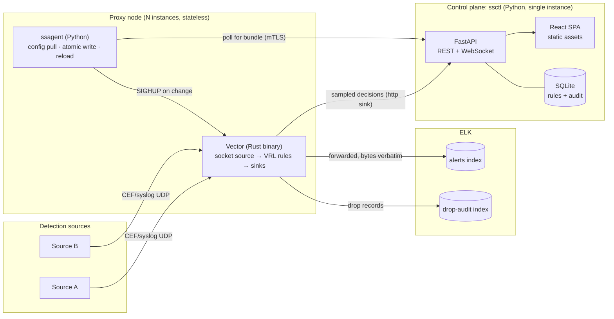

# Decision register: CEF and syslog filtering proxy

**Status:** Decided · **Owner:** Yurii · **Date:** July 30, 2026
**Supersedes:** the working assumptions in [open-questions.md](open-questions.md)
**Evidence:** [research-prior-art.md](research-prior-art.md) · **Terms:** [glossary.md](glossary.md)
**Stack:** Python backend, React frontend · **Style:** Microsoft Writing Style Guide

Every question from Q-01 to Q-53 has an answer here. Where a decision is a business call rather
than an engineering one, it carries a flag (⚑). Those are still decided and still being built
against, but raise them first in review.

> [!IMPORTANT]
> The governing principle for this register is production-grade, no overkill, and no unfinished
> features. Anything that ships is complete, tested, documented, and operable. Anything that isn't
> complete in version 1 is an explicit non-goal. There are no stubs, no disabled toggles, and no
> "coming soon" tabs.

## The primary decision

> ### D-00: Adopt Option B, a control plane over a proven data plane
>
> Build the rule model, the compiler, the UI, the audit trail, and the simulator in Python and
> React. Delegate packet handling, CEF parsing, and delivery to Vector.

**Why.** [research-prior-art.md](research-prior-art.md) established that the data plane is
commodity. Six mature tools already receive, parse, filter, and forward. No open-source tool offers
an analyst-facing rule UI with an auditable drop trail. Building the commodity half means owning a
CEF parser that better-resourced teams still have open bugs against, and reimplementing buffering,
backpressure, sinks, and observability that Vector already provides.

**The Python stack turns this from a preference into a near-requirement.** CPython can't hit the
D-21 targets of 20,000 EPS sustained and 100,000 EPS in a burst for per-packet UDP work with
sub-millisecond p99 latency. The global interpreter lock, per-object allocation, and garbage
collection pauses all work against it. You could reach part of the way with `uvloop`,
`SO_REUSEPORT`, and multiple processes, but the tail latency would stay poor and the engineering
cost would be high. So writing the data plane in the mandated stack isn't a real option, and
delegating it isn't a compromise. It's the correct reading of the constraint.

Option B therefore puts Python exactly where Python is strong: a low-throughput API, a rule
compiler, a data model, and a web application.

**What you accept in exchange.** An operational dependency on a third-party binary, a debugging
story that spans two processes, and a rule model bounded by what VRL can express. You also lose
the single-static-binary deployment that a Go or Rust control plane would have given you, so
deployment is now a container image with a Python runtime. The risks section covers each one.

**Reversibility.** The rule model and the UI are the durable assets. The compiler backend is about
one module. If Vector ever becomes untenable, the same rule model compiles to syslog-ng config
without touching the control plane.

## Resulting architecture



**Two planes, with a hard boundary.** The control plane isn't in the data path. If `ssctl` is
down, proxy nodes keep running from their last known good cached bundle indefinitely. Losing the
UI must never lose an event. That's the most important structural property of this design, and it
matters more now than it did with a Go control plane, because Python gives you more ways to stall
a process.

| Component | What it is | Why |
|---|---|---|
| Vector, pinned to a version | The data plane: socket source, VRL transform chain, sinks | Proven, fast, `parse_cef` built in, and a single static binary with no runtime |
| `ssagent` | A small Python process on each proxy node, roughly 200 lines | Polls for a new config bundle, verifies the checksum, writes it atomically, and signals Vector to reload. Caches the last known good bundle on disk. |
| `ssctl` | Python and FastAPI, serving a built React app, backed by SQLite | Rule management, the compiler, the audit log, the simulator, the live view, and health |

### Why `ssagent` is smaller than it looks

Vector does more of the work than the earlier draft assumed, which shrinks the agent to one job.

- **Sampled decisions go straight to the control plane.** Vector's `sample` transform feeds an
  `http` sink that posts to a FastAPI endpoint. The agent never touches event data, so no
  event-rate traffic passes through Python on the node.
- **Config delivery is the agent's only irreducible job.** Vector reads config from disk, so
  something has to fetch it. On Kubernetes you can drop the agent entirely and use a ConfigMap with
  Vector's `--watch-config`. On virtual machines and Docker Compose, the agent does the pull.

That leaves the agent as a poller with a checksum check and a signal. It's small enough to read in
one sitting, which is the right size for something running next to a security data path.

## What ships in version 1

Everything in this list is complete, not partial:

1. A rule engine: an ordered chain, first match wins, compiled to VRL.
2. Fourteen operators: `eq`, `ne`, `in`, `not_in`, `contains`, `starts_with`, `ends_with`, `glob`,
   `cidr`, `lt`, `lte`, `gt`, `gte`, `exists`, and `not_exists`, each with tests and UI support.
3. Fail-open behavior end to end, including on parse failure.
4. Drop auditing: a metadata record for every dropped event, with per-rule opt-in for the full
   payload.
5. Hot reload, with a measured zero-packet-loss test in CI.
6. A React UI: rule management with validation, a live decision view, health and throughput, and a
   rule simulator.
7. Authentication and authorization: local accounts, three roles, enforced server-side. OpenID
   Connect is **not** implemented; see the known gaps below.
8. An append-only audit log covering every change, readable through the API.
9. Observability: Prometheus metrics including kernel-level UDP drop counters, plus structured
   logs.
10. `cefgen`: a synthetic and adversarial CEF traffic generator that doubles as the load harness.
11. CI/CD: lint, type check, test, fuzz, SAST, SCA, SBOM, container scan, sign, deploy.
12. Deployment: Docker Compose for development and demos, Kubernetes manifests for production,
    both working.

## Known gaps: decided, but not built

The register opens by promising that anything shipped is complete and anything unfinished is an
explicit non-goal. An audit of these decisions against the code found seven that were written as
delivered and are not. They are recorded here rather than quietly corrected, because the gap
between a decision register and its implementation is exactly what such a register exists to
make visible.

| # | What the decision says | What exists | Disposition |
|---|---|---|---|
| **D-09** | Colliding CEF extension keys kept as `ext.severity` | `parse_cef` discards the extension before we see it | **Not implementable** on the delegated parser. Full note above. |
| **D-17** | Truncation-shaped parse failures counted separately from other parse failures | One parse-error path, no truncation counter | **Deferred.** The `.ss` record now carries `cef_ok` and `syslog_ok`, which is the larger half of the diagnostic. Truncation detection needs a length heuristic nobody has validated against real traffic. |
| **D-30** | Alembic migrations | `alembic` is a dependency; there is no `alembic.ini`, no `env.py`, and no versions directory. Tables come from `init_db()` | **Deferred.** Honest for a prototype with one writer and no production data to migrate. It becomes required the first time a schema change meets a live database. |
| **D-30, D-31** | One-click YAML export of rules | No endpoint and no CLI command. `GET /api/bundles/active/config` exports the compiled Vector config, which is not the same artifact | **Deferred.** The audit trail is served by the append-only log; export was for GitOps shops, and D-30 already decided the UI is authoritative. |
| **D-35** | The admin API binds a separate listener from the sampled-decision intake | One app, one port | **Deferred**, with the trust boundary documented at the endpoint. Currently a network-policy control rather than an application one. See the risk table. |
| **D-40** | Source IP allow-listing and per-source rate limiting as defense in depth | Not implemented | **Deferred.** D-40 already names the network ACL as the primary control and these as defense in depth. Shipping them half-built would be worse than the honest gap, and spoofed UDP defeats an IP allow-list anyway. |
| **D-47** | JSON Schema generated from the Pydantic models as the agent-readable artifact | FastAPI's `/openapi.json` carries the rule schema, but nothing generates a standalone artifact | **Partly met.** The anti-drift property D-47 wanted holds, since the schema is generated from the same models the API validates against. A dedicated export command does not exist. |

None of these are stubs, disabled toggles, or dead config keys. Each is either absent or, for
D-47, met by a different mechanism than the one named.

## Explicit non-goals for version 1

These are decided out, not forgotten. None of them appear as disabled UI, dead config keys, or
stub endpoints.

| Not building | Why | Q |
|---|---|---|
| Deduplication, throttling, and storm suppression | A stateful engine and an entirely different design. Most likely version 2. | Q-10 |
| Time-based and maintenance-window rules | Needs a scheduler and a time zone policy, and there's no stated requirement | Q-11 |
| Multiple destinations | The rule action is modeled as a named output, so it's config later, but version 1 ships one output | Q-12 |
| Multi-tenancy | No stated requirement, and a large data-model cost | Q-32 |
| A regular expression operator | A denial-of-service surface. `glob` and `contains` cover the realistic cases. | Q-06 |
| Disk spooling | Meaningless with UDP output. Revisit with D-13. | Q-23 |
| TLS or mutual TLS on ingress | Constrained by the detection source, not by us | Q-41 |
| Active/active HA | Ships single-node. Active/passive is a documented deployment topology, not code. | Q-25 |
| Transparent proxying | Only needed if D-16 turns out to be wrong | Q-16 |
| Event enrichment and transformation | Pass-through only. Annotation exists but ships off. | Q-03 |
| A Python event-processing path | Deliberate. See D-00 and D-21. Python never sees event-rate traffic. | Q-21 |

## Decisions

### Filtering behavior

| # | Q | Decision | Rationale |
|---|---|---|---|
| **D-01** ⚑ | Q-01 | **Fail open.** No match means forward. The `default_action` key is required, with no implicit fallback. The active mode shows in the UI header and in the startup log. | On a security alerting path, too much data beats a missed event. A required key means someone always chooses deliberately. |
| **D-02** ⚑ | Q-02 | **Every drop produces an audit record** with the event ID, the matched rule ID and version, the timestamp, the source, and the decision, written to a separate `drop-audit` index. Setting `retain_payload: true` on a rule stores the full event. | Answers "prove nothing important was dropped" without duplicating full event volume. Per-rule opt-in covers high-risk rules. |
| **D-03** | Q-03 | **Pass-through only.** Annotation exists but ships disabled. | Zero risk to existing ELK dashboards on day one. Turning it on is a one-line config change. |
| **D-04** | Q-04 | **Schema-agnostic.** Events are maps of names to values. The UI shows the 10 known fields first, with an "other field" option. | Forced by the research: these field names aren't in any CEF dictionary, so a fixed structure would be wrong. |
| **D-05** | Q-05 | **An ordered chain, first match wins.** Each rule carries `forward` or `drop`. Conditions within a rule combine with AND. Use `in [...]` or a second rule for OR. | The firewall model SOC engineers already know. Rule order is explicit rather than emergent, and it compiles to a clean VRL if/else chain. |
| **D-06** | Q-06 | Ship the fourteen operators listed above. **No regular expressions in version 1.** | Regular expressions are both a denial-of-service risk and hard to explain in a UI. `glob` and `contains` cover the realistic need, and adding them later is additive. |
| **D-07** | Q-07 | **Ignore case by default** for strings, with `case_sensitive: true` per condition. Field names also ignore case. | Host name capitalization varies by source. A case-sensitive default produces rules that silently don't match, which is the worst failure mode here. |
| **D-08** ⚑ | Q-08 | `severity` is a CEF integer from 0 to 10, with the standard words accepted. **`filterpriority` is an integer where lower means more urgent.** `notificationtime` is milliseconds since 1970. Tests assert all three and fail loudly on contradiction. | No documentation exists. These are the conventional readings, and the tests are the tripwire. This is the highest-value question to get answered. |
| **D-09** ⚠️ | Q-09 | `severity` and `name` are **CEF header fields**. The intent was to keep a colliding extension key as `ext.severity`. **Not implemented, and not implementable on Vector's `parse_cef`.** See the note below. | Logstash ships exactly this bug today. So, it turns out, do we. |
| **D-10** | Q-10 | Out of scope. The rule schema reserves room. | See the non-goals. |
| **D-11** | Q-11 | Out of scope. | See the non-goals. |
| **D-12** | Q-12 | One output in version 1, with the rule action modeled as a **named output** from day one. | Costs nothing now and saves a schema migration later. |

> [!WARNING]
> **D-09 is not implemented, and the reason is a real finding about D-00.**
>
> The decision says a colliding CEF extension key is preserved as `ext.severity`, so a collision
> is visible rather than silently resolved. Vector's `parse_cef` makes that impossible. It
> returns a flat map and the header value wins, so the extension is destroyed inside the
> function before any of our code runs:
>
> ```
> parse_cef("CEF:0|Acme|Detector|1.2|100|HEADER_NAME|9|name=EXT_NAME severity=EXT_SEV other=ok")
>   → { "name": "HEADER_NAME", "severity": "9", "other": "ok", ... }
> ```
>
> `EXT_NAME` and `EXT_SEV` are gone. There is no option to change this, and no post-processing
> can recover a value the parser already discarded.
>
> **So the system currently ships the exact bug D-09 was written to prevent.** The rationale
> column called out Logstash for it, which now reads as an unearned dig.
>
> Recovering the collision means splitting the CEF header on unescaped `|` ourselves and calling
> `parse_cef` only for the extension half. That is precisely the parser work D-00 delegates, and
> the escaping rules in Q-19 are why delegating it was right. Writing a partial CEF parser to fix
> a visibility problem would trade a rare wrong-threshold case for a common misparse.
>
> **This is the clearest cost of Option B found so far.** The trade in D-00 was stated as
> "a rule model bounded by what VRL can express." The sharper version is that *you also inherit
> the delegated component's data loss, and you cannot patch around it.* The mitigation is the
> one the register already has: D-19's conformance corpus, so a future `parse_cef` that fixes
> this is detected on a version bump.
>
> Practical impact is small. It needs an event whose extension repeats a header name, and the
> header value is the one an analyst means in nearly every case. It is recorded because a known,
> bounded, documented gap is worth more than a decision that reads as delivered.

> [!NOTE]
> **Why syslog fields are namespaced (D-14).**
>
> Making rules match syslog meant deciding what `severity` means, because both parsers produce
> one and they are not the same thing:
>
> | | CEF | syslog |
> |---|---|---|
> | Type | Integer, 0 to 10 | Word: `info`, `notice`, `err` |
> | Direction | Higher is worse | Lower priority number is worse |
>
> Merging them flat gives one field name two types and two directions, resolved by whichever
> parser ran last. A rule reading `severity gte 8` would mean one thing for CEF and silently
> never match syslog.
>
> So syslog fields nest under `syslog.`, and `severity` and `syslog.severity` are two fields an
> analyst picks between. **CEF fields deliberately stay at the top level**: all ten of the field
> names in the task are CEF extension keys, so prefixing them would have broken every existing
> rule to solve a problem CEF does not have.

### Transport and wire format

| # | Q | Decision | Rationale |
|---|---|---|---|
| **D-13** ⚑ | Q-13 | **UDP output in version 1** for drop-in compatibility. Output is a Vector sink, so TCP, TLS, and Elasticsearch are config changes rather than a redesign. The architecture document recommends TLS. | A zero-change cutover matters more than delivery guarantees for version 1, and the upgrade path is one config block. |
| **D-14** | Q-14 | Accept **both RFC 3164 and RFC 5424**, detected automatically. Bare `CEF:` payloads are accepted too. **Rules match on syslog fields as well as CEF fields**, with syslog fields addressed under a `syslog.` prefix. | Vector's syslog handling covers both, and automatic detection removes a deployment-time question. The namespace is what keeps `severity` honest: see the note below. |
| **D-15** | Q-15 | **Forward the original bytes exactly.** Use Vector's `socket` source to keep the raw message, parse into a scratch namespace for the decision only, and emit `.message` unchanged. | Proves the proxy is non-lossy at the content level and guarantees ELK's existing pipeline sees byte-identical input. This is what makes cutover safe. |
| **D-16** ⚑ | Q-16 | **Assume nothing downstream depends on packet source IP.** Verify it against the real Logstash config as a pre-cutover checklist item. | Cheap to verify and expensive to discover late. Not worth building transparent proxying against a hypothetical. |
| **D-17** | Q-17 | A 64-KB receive buffer. Count truncation-shaped parse failures **separately** from other parse failures. | Telling "the sender truncated at 1,024 bytes" apart from "my parser is wrong" in production is worth one extra counter. |
| **D-18** | Q-18 | **Forward unparseable events**, count them, and log a rate-limited sample at WARN. | Consistent with D-01. Unparseable input is more often a parser bug than a bad event, and forwarding keeps the failure visible. |
| **D-19** | Q-19 | Use Vector's `parse_cef`, **pinned to a tested version**, with a conformance corpus in CI covering the known escaping edge cases. Call it in its **fallible** form so a parse error routes to the D-18 fail-open path. | This is the honest way to handle the open `parse_cef` bugs. Rather than pretending they don't exist, make them fail safe and detect regressions on version bumps. |
| **D-20** | Q-20 | Multiple sources, **one global rule chain**. Per-source behavior comes from rules matching source fields. IPv4 and IPv6 both. | Per-source rule sets are multi-tenancy under another name. See D-32. |

### Scale and availability

| # | Q | Decision | Rationale |
|---|---|---|---|
| **D-21** | Q-21 | Target **20,000 EPS sustained and 100,000 in a burst**, adding under 1 ms at p99, on a single node. `cefgen` measures the real number in CI. **All of this load lands on Vector. No event-rate traffic reaches Python.** | Well within Vector's demonstrated range, and stated plainly so a real figure can contradict it. The second sentence is the load-bearing one for this stack: see the risks section. |
| **D-22** | Q-22 | Assume around 100 rules, compiled to a VRL if/else chain. **Measured: linear evaluation is adequate at 100 rules and 20,000 EPS per worker with zero loss. The ceiling is VRL compile time, not evaluation speed, and it lands between 200 and 400 rules.** | Rule evaluation happens inside Vector, so Python performance is irrelevant here. The benchmark this decision asked for now exists (`ssperf --rules-sweep`) and it moved the limiting factor: compile time roughly quadruples per doubling of the chain, so a 400-rule bundle takes 16 seconds to compile and the node does not start within a 30-second probe. |
| **D-23** | Q-23 | A bounded in-memory queue, oldest dropped first, with an alerting metric on any drop. No disk spooling. | With UDP output there's nothing to buffer for. Revisit alongside D-13. |
| **D-24** | Q-24 | **In scope and prominent.** Set `receive_buffer_bytes` explicitly and publish a metric sourced from kernel counters, not just application counters. | The research confirmed this as a documented standard failure mode. Reporting zero drops while the kernel discards thousands is the most dangerous bug this system can have. |
| **D-25** | Q-25 | Proxy nodes are **stateless and horizontally scalable** by construction, since config is pulled and no local state exists. Version 1 ships single-node. **Active/passive with a virtual IP address is documented**, sized for n−1, with load balancer stickiness disabled. The control plane stays single-instance. | HA here is a deployment topology, not application code. The control plane needs no HA because it isn't in the data path. |
| **D-26** | Q-26 | Containers. Docker Compose for development and demos, Kubernetes for production. Non-root, read-only root file system, port 514 via `CAP_NET_BIND_SERVICE`. Two images: `sixthsense-control` and `sixthsense-node`. Assume the network isn't disconnected. | Two images rather than one, because shipping the full control plane onto every proxy node would be waste. Both build from one Python package with two entry points. |

### Configuration and change management

| # | Q | Decision | Rationale |
|---|---|---|---|
| **D-27** | Q-27 | The audience is **SOC analysts, not engineers**. The UI validates, previews impact, and requires confirmation for any rule projected to drop more than 5% of traffic. | The blast-radius confirmation is the cheapest guard against a catastrophically broad drop rule. |
| **D-28** | Q-28 | **Hot reload is required.** `ssagent` writes the new config atomically and signals Vector, which rebuilds only the changed transforms, so the UDP source stays bound. **CI asserts zero packet loss across a reload under load.** | The assertion is the point. Reload behavior gets verified continuously rather than assumed. |
| **D-29** | Q-29 | **A core feature.** Shadow mode globally and per rule, evaluating, counting, and logging while forwarding everything, plus offline replay of a captured sample. **Simulation runs through a real Vector instance**, never a second parser. | Two parsers that disagree is a guaranteed bug class. It matters even more here, because a Python reimplementation of CEF parsing would diverge from Vector's within a week. |
| **D-30** | Q-30 | **The UI is the source of truth**, backed by SQLite through SQLAlchemy, with Alembic migrations, an append-only change log, and one-click YAML export and rollback. | Follows from D-27. SQLite is right-sized: one writer, roughly 100 rules, and low write volume. Export gives GitOps shops the audit artifact without a two-writer conflict story. |
| **D-31** | Q-31 | Every change records the actor, the timestamp, and the full before-and-after difference in an append-only log that ships off the box. **No hard deletes, only disable.** | Changing a filter rule changes which security telemetry you keep, and that's auditable in every regime worth naming. |
| **D-32** | Q-32 | Single tenant. | See the non-goals. |

**Config distribution.** Nodes poll `ssctl` over mutual TLS on an interval, compare a bundle
version, download when it changes, verify the checksum, write atomically, and signal Vector. They
cache the last known good bundle on local disk and run from it if `ssctl` is unreachable. Pull
beats push because it survives node restarts with no orchestration and degrades safely.

### User interface

| # | Q | Decision | Rationale |
|---|---|---|---|
| **D-33** | Q-33 | In order: **rule management with validation, a live decision view, health and metrics, then the simulator.** Long-term search stays in ELK. | Four things done well. Reimplementing search over ELK data, next to ELK, would be the definition of overkill. |
| **D-34** | Q-34 | **OpenID Connect** in production, with local accounts for bootstrap and break-glass. The development bypass **can't be enabled when the app binds a non-loopback interface**, enforced in code. Roles are `viewer`, `rule-editor`, and `admin`, enforced server-side in FastAPI dependencies, never in React. | A UI with no authentication that can drop security events is itself a control failure. Enforcing in FastAPI dependencies keeps authorization in one auditable place. React hides controls for usability, not for security. |
| **D-35** | Q-35 | A management network, with TLS required regardless. The admin API binds on a **separate listener** from the sampled-decision intake endpoint. | Compromising the UI must not let someone reconfigure ingress. |
| **D-36** | Q-36 | Contents are visible to `rule-editor` and above. `viewer` sees metadata and counts. Field-level redaction is configurable and applied server-side before serialization. | A live view is an exfiltration surface, so default to showing less. Redacting server-side means the browser never receives what the role can't see. |
| **D-37** | Q-37 | **Vector samples at the node** and posts to `ssctl`, which holds a bounded ring buffer in memory and pushes to browsers over WebSocket. The path is **strictly non-blocking**: if a browser can't keep up, the browser drops frames. | A browser tab must never apply backpressure to the event path. Sampling at the node also keeps Python out of the event-rate path, which is what makes this stack workable. |

### Build, security, and DevSecOps

| # | Q | Decision | Rationale |
|---|---|---|---|
| **D-38** | Q-38 | Build the **control plane only**, per D-00. | See the primary decision. |
| **D-39** ⚑ | Q-39 | **Python 3.12** with FastAPI, Pydantic v2, SQLAlchemy 2.0, Alembic, and uvicorn, managed with `uv`. **React with TypeScript**, built by Vite. Vector for the data plane. | Matches the mandated stack. Pydantic earns its place twice: it validates the rule schema and generates JSON Schema for free, which is exactly the agent-readable artifact D-47 calls for. **The flag is on TypeScript:** you specified JavaScript, and TypeScript is a superset that pays off on a rule schema this complex. Say the word and it's plain JavaScript with JSDoc types. |
| **D-40** | Q-40 | The network ACL is the **primary** control. The proxy adds source IP allow-listing and per-source rate limiting as **defense in depth, explicitly not authentication**, since spoofed UDP defeats an IP allow-list. The threat model documents **the filter as a detection-evasion surface**. | The interesting attack isn't flooding. It's crafting events that match a broad drop rule in order to hide, and that belongs in the design document. It's also an argument for D-02's audit trail. |
| **D-41** | Q-41 | Plaintext UDP ingress, constrained by the source. TLS available and recommended on output. The residual risk is documented with its compensating control, which is network segmentation. | An honest statement of a constraint we don't control. |
| **D-42** | Q-42 | A **SOC 2-style baseline**: audit trail, access control, and change management. FIPS and FedRAMP aren't assumed. | FIPS constrains the choice of cryptography library, and it's more disruptive in Python than in Go. Assuming it unprompted is overkill, and retrofitting it is a known, bounded change. |
| **D-43** | Q-43 | **GitHub Actions.** Python: `ruff` for lint and format, `mypy --strict` for types, `bandit` and Semgrep for SAST, `pip-audit` for dependency vulnerabilities. JavaScript: `eslint` and `osv-scanner`. Shared: Trivy for containers, Syft for SBOMs, Gitleaks for secrets, Cosign for signing. Each stage names a swappable equivalent. | Concrete enough to run, and documented so an organization with a different mandated scanner can substitute one line. `mypy --strict` is not optional on the compiler: it's the cheapest defense against the injection surface in D-44. |
| **D-44** | Q-44 | **Fuzz the rule compiler** with Hypothesis for property-based tests and Atheris for coverage-guided fuzzing. Validate generated configs with **both `vector validate` and `vector vrl`**. Run the CEF conformance corpus against the pinned Vector on every dependency bump. Gate production releases on a documented security review. | Under Option B we don't own the parser, so the fuzzing target moves to what we do own. That turns out to be the more dangerous target. **Amended July 31, 2026:** `vector validate` does not compile VRL, so it was never a sufficient gate on its own. See the implementation note below. |
| **D-54** | new | **Pin Vector to 0.51.0 or later.** | Found during implementation. Earlier releases do not reload transforms that reference external VRL files on SIGHUP, which D-28 depends on. This is a hard floor, not a preference. |

> [!WARNING]
> **D-44 detail: the injection surface Option B creates.**
>
> Compiling analyst-authored rules into VRL puts user-controlled values inside generated code. An
> analyst who types a quote, a brace, or a newline into a rule value is a code-injection vector
> against our own data plane, capable of producing a config that drops everything.
>
> Python makes this both easier to get wrong and easier to get right. Easier to get wrong, because
> f-strings and `str.format` make careless interpolation the path of least resistance. Easier to
> get right, because Pydantic gives you a typed boundary at the exact place the risk lives.
>
> The mitigation is a first-class requirement:
>
> - **Never interpolate user values into VRL with f-strings or `%`.** Emit every value through a
>   strict typed encoder that accepts only Pydantic-validated types.
> - **Validate generated configs with `vector validate`** in CI and again before any activation.
> - **Fuzz the compiler continuously** with Hypothesis, asserting that output is always valid VRL
>   and always semantically equivalent to the rule.
>
> This is the highest-risk code we own, so it gets the fuzzer and the strictest type checking.

> [!IMPORTANT]
> **Amendments from implementation.** Five things surfaced only by running real Vector, and all
> five would have shipped otherwise. Full detail in [architecture.md](architecture.md).
>
> 1. **`vector validate` does not compile VRL.** The D-44 gate as originally written was
>    insufficient. `vector vrl -p <program> -i <event>` compiles and exits 70 on error. Both now
>    run, in CI and before every activation.
> 2. **Comparing null to a number is a fallible predicate** and VRL rejects it at compile time.
>    An `x != null &&` guard does not narrow the type. Numeric comparisons coalesce with
>    `?? false`, which is also the right semantics: a missing field never satisfies a threshold.
> 3. **`parse_syslog` consumes the `CEF:` marker**, so the body it returns is no longer valid
>    CEF. The compiler now falls back to locating `CEF:` in the raw bytes. Without this, every
>    rule silently stopped matching while events kept flowing, which is exactly the failure mode
>    the research warned about: a misparse produces a wrong decision rather than a crash.
> 4. **`find` is typed `integer` but returns `null` when the needle is absent**, so the marker
>    fallback added in amendment 3 aborted the program on every event without a `CEF:` marker.
>    The rule chain never ran for plain syslog, and no `forward_parse_error` was ever counted.
>    Events still forwarded, so nothing looked broken.
>
>    Note this reads as the opposite of amendment 2, and the distinction is the whole lesson:
>    `?? false` is *rejected here* (E651, "unnecessary error coalescing operation") because the
>    type checker believes the comparison is infallible. Amendment 2 applies when the checker
>    knows an expression is fallible; amendment 4 applies when it is wrong. The guard is
>    `marker != null && marker >= 0`.
> 5. **`vector vrl` exits 0 on a runtime error.** This is why amendment 4 passed the D-44 gate.
>    Exit codes only report compile failures. The gate now runs a probe corpus covering every
>    input shape and requires one well-formed decision per event, which is the check that would
>    have caught amendment 4 on the day it was written.
>
> The pattern is worth recording, and it recurred: a design document asserted a third-party
> behavior that nobody had executed. Four of these five were in that category. The fifth,
> amendment 5, is the more useful lesson — **the gate that catches the class is worth more than
> the fix for the instance.**

### Deliverables and process

| # | Q | Decision | Rationale |
|---|---|---|---|
| **D-45** | Q-45 | **Both readings.** A `cefgen` synthetic and adversarial traffic generator, plus a documented agent-assisted workflow for writing and maintaining tests. Generated tests are **reviewed, never trusted**. | They complement each other and each is modest. `cefgen` is a Python CLI, since it's a test tool and doesn't need to sustain production rates. The review condition is the honest part. |
| **D-46** | Q-46 | A **production-track slice**: a correct rule model, a working compiler, hot reload, metrics, a UI with rule management, a live view, and simulation, plus tests and CI. Non-goals are listed rather than half-built. | This is the "no unfinished features" principle made concrete. |
| **D-47** | Q-47 | **Both audiences, cross-linked.** For people: a readme, an architecture document, decision records, and Mermaid diagrams, which render in GitHub with no toolchain. For agents: `CLAUDE.md`, **JSON Schema generated from the Pydantic rule models**, and structured fixtures. Every document names its audience in the header. | Generating the schema from the models means the agent-readable spec can't drift from the implementation. That's a real benefit of the Python stack, not a consolation. |
| **D-48** | Q-48 | A tooling section in the documents, a repository configured for agent-assisted work, and honest notes on where AI assistance needed correcting. The rule compiler and the security model are where it's least reliable. | The notes about failures are the credible part of any such section. |
| **D-49** | Q-49 | Documents and reasoning carry at least as much weight as code, and the prototype is scoped to D-46. | Stated so the scope choice reads as deliberate rather than as an unfinished build. |
| **D-50** | Q-50 | **The cutover plan is part of the deliverable.** Shadow mode first, forwarding everything while logging what would have dropped. Compare counts against the pre-insertion baseline over an agreed soak period, then enable enforcement. Rollback is one step: point the source back at ELK. | Inserting into a live alerting path is the riskiest moment in this system's life, and D-29's shadow mode exists partly to serve this. |
| **D-51** ⚑ | Q-51 | **Assume commercial procurement isn't available.** Build on open source, meaning Vector. | If Cribl is procurable, the honest recommendation changes, because it does most of this off the shelf. Confirm this first in review. |
| **D-52** ⚑ | Q-52 | Proceed without knowing which product emits these events. D-08's assertions are the tripwire. | A one-line question with a large payoff. It resolves D-08 instantly. |
| **D-53** ✅ | Q-53 | **Confirmed by Yurii on July 30, 2026.** The driver is analyst noise reduction **plus ELK ingest load**, so filtering has to happen before the network hop. | This is what justifies a proxy at all. Had noise in Kibana been the only cost, a Logstash conditional would have been the right answer, because it adds no component to the alerting path. Ingest load rules that out. D-02's per-drop audit trail is a second justification that no cheaper layer provides. |

## Risks accepted

| Risk | Mitigation | Why it's acceptable |
|---|---|---|
| **Python can't handle event-rate traffic** | Vector holds the entire event path. Sampling happens at the node before anything reaches Python (D-21, D-37). | This is the central structural constraint of the design, and every component boundary respects it. Treat any proposal that routes events through Python as a design regression. |
| Vector `parse_cef` escaping bugs | A pinned version, a conformance corpus, and fallible parsing that fails open (D-19) | Any parser we wrote would have the same bugs, just undiscovered. A Python reimplementation would be slower and no more correct. |
| VRL injection through rule values | A typed encoder, `mypy --strict`, a `vector validate` gate, and Hypothesis fuzzing (D-44) | A bounded surface, and now the explicit fuzz target |
| A generated program that compiles and then aborts at run time | A probe corpus covering every input shape, run before activation, requiring one decision per event (D-44 amendment 5) | The failure mode is silent by construction: `drop_on_error = false` means events keep flowing while every rule is skipped. Only an output check catches it. |
| The decision intake endpoint is unauthenticated and shares a port with the admin API | Network segmentation, and the trust boundary documented at the endpoint | Accepted for version 1, and D-35 is listed as a known gap rather than as delivered. Whoever can reach the port can fabricate live-view entries and skew the impact preview that an analyst uses to size a rule, so the segmentation is load-bearing rather than defense in depth. |
| A third-party runtime dependency | The compiler backend is one module, and the rule model is portable (D-00) | Reversible by design |
| No single-binary deployment | Container images with pinned base layers, built from one Python package (D-26) | A real cost of the stack. Containers were the deployment target anyway, so the practical loss is small. |
| UDP output can't guarantee delivery | The sink abstraction makes TCP and TLS a config change (D-13) | Drop-in compatibility wins for version 1 |
| The control plane is a single instance | It isn't in the data path, and nodes run from cached config indefinitely | Losing the UI must never lose an event, and it doesn't |
| D-08 field semantics could be wrong | Assertions fail loudly in tests (D-08, D-52) | The cheapest possible tripwire against an unanswerable question |

## When to revisit

Each of these flips a decision above. None of them require a redesign.

- Commercial procurement becomes available. Re-evaluate D-00 and D-51 against Cribl.
- Sustained load passes about 50,000 EPS. Revisit D-22 and the node count in D-25. Nothing changes
  in Python, because Python isn't on that path.
- Rule count passes about 200. Revisit D-22. The problem will be VRL compile time slowing reloads,
  not evaluation speed, so the fix is splitting the chain across workers or indexing rules by
  field to reduce branch count, not a faster loop.
- The sampled-decision rate to `ssctl` passes about 500 EPS. Revisit D-37 sampling ratios before
  revisiting the framework, since the fix is almost certainly a sampling ratio.
- SQLite write contention appears, or the control plane needs more than one instance. Move to
  PostgreSQL. SQLAlchemy makes this a configuration change plus a migration.
- The ELK receiver gains TLS syslog, or an Elasticsearch sink becomes permitted. Execute D-13.
- A real storm-suppression requirement appears. That's version 2, per D-10.
- A disconnected network or a FIPS requirement surfaces. Revisit D-26, D-42, and D-43.
