# DevSecOps approach

**Status:** Proposed · **Owner:** Yurii · **Date:** July 30, 2026
**Stack:** Python backend, React frontend, Vector data plane · **Terms:** [glossary.md](glossary.md)
**Decisions:** [decisions.md](decisions.md) D-43, D-44 · **Style:** Microsoft Writing Style Guide

## What makes this utility different

Three properties drive every choice below. Generic pipeline advice misses all three.

1. **This utility can silently delete security telemetry.** A bad rule blinds the SOC, and nothing
   alerts on absence. Correctness failures here are invisible by default.
2. **The rule compiler turns analyst input into executable config.** Analysts write rules, the
   compiler emits VRL, Vector runs it. That's a code-injection path from a web form to the data
   plane.
3. **Rule changes bypass CI entirely.** An analyst clicking Save in the UI deploys to production in
   seconds, with no pull request, no review, and no pipeline. That's the second delivery path, and
   it's the dangerous one.

> [!IMPORTANT]
> There are two pipelines, not one. Most DevSecOps documents cover only the code path. The rule
> path ships far more often, has a far shorter fuse, and needs equivalent controls.

## The two pipelines

```mermaid
flowchart TB
  subgraph code["Pipeline 1: code (days, engineer-driven)"]
    C1[commit] --> C2[lint + types] --> C3[test + fuzz] --> C4[SAST + SCA]
    C4 --> C5[build + SBOM] --> C6[scan + sign] --> C7[deploy]
  end
  subgraph rules["Pipeline 2: rules (seconds, analyst-driven)"]
    R1[author in UI] --> R2[schema validate] --> R3[compile to VRL]
    R3 --> R4["vector validate<br/>+ vrl compile<br/>+ probe corpus run"] --> R5[impact preview] --> R6[shadow soak]
    R6 --> R7[publish bundle] --> R8[node pulls + reloads] --> R9[watch drop rate]
  end
```

## Pipeline 1: code

Every stage blocks the merge unless marked advisory.

| Stage | Tools | Gate |
|---|---|---|
| Lint and format | `ruff`, `eslint` | Blocking |
| Types | `mypy --strict`, `tsc --noEmit` | Blocking. **`--strict` is mandatory on the compiler module**, which is the cheapest defense against property 2. |
| Unit and integration tests | `pytest` | Blocking, with coverage floor on the compiler only |
| Property tests and fuzzing | Hypothesis, Atheris | Blocking on regressions. Corpus is committed. |
| SAST | `bandit`, Semgrep | Blocking on high, advisory on medium |
| Dependency scan | `pip-audit`, `osv-scanner` | Blocking on known-exploited, advisory otherwise |
| Secret scan | Gitleaks, pre-commit and CI | Blocking |
| Build | Docker, pinned base digests | Blocking |
| SBOM | Syft, CycloneDX format | Blocking. Must include the Vector binary. |
| Container scan | Trivy | Blocking on high |
| Sign | Cosign, keyless with OIDC | Blocking |
| Deploy | GitHub Actions to Kubernetes | Manual approval for production |

> [!WARNING]
> **`vector validate` alone is not a gate.** It checks configuration structure and does **not**
> compile VRL. A remap transform referencing an undefined variable passes it cleanly, then fails
> in the topology builder at startup. On a node that means Vector refuses to start, the last
> known good config keeps running, and the operator sees a rollout that silently did nothing.
>
> `vector vrl -p <program> -i <event>` does compile the program and exits 70 on error. Run both.
> This was found by running the data plane, after the design document had already claimed
> `vector validate` was sufficient.

> [!CAUTION]
> **And two checks were still not a gate.** `vector vrl` exits **0** on a *runtime* error. It
> prints the message on that event's output line and carries on, so a program that aborts on
> every non-CEF event passes an exit-code check cleanly. That is exactly what happened: a
> comparison against a `find` result that is typed integer and returns null at run time aborted
> the decide program for all plain syslog, and the gate reported success.
>
> The failure is silent by construction. `drop_on_error = false` means the event still forwards,
> so throughput, error rates, and the ELK index all look normal while every rule is skipped.
>
> The gate now runs a **probe corpus** — CEF in syslog, bare CEF, RFC 3164, RFC 5424, garbage —
> and requires one well-formed decision per input event. `test_a_runtime_abort_is_caught`
> reintroduces the bug and asserts the gate rejects it.
>
> The lesson generalizes past this bug: **an exit code tells you a program compiled, not that it
> works on your inputs.** Any gate over a third-party tool should assert on output, and its
> corpus has to cover every branch the generated code can take.

### The four tests that actually matter

Everything above is table stakes. These four are specific to this utility, and I'd defend them
over any coverage percentage.

| Test | What it catches | Why it exists |
|---|---|---|
| **Compiler fuzzing** (Hypothesis) | A rule value containing a quote, brace, or newline producing invalid or attacker-controlled VRL | Property 2. Asserts output is always valid VRL and always semantically equivalent to the input rule. |
| **Zero-packet-loss reload** | A config reload that closes the UDP socket and drops in-flight events | Runs `cefgen` at 20,000 EPS across a reload and asserts sent equals received |
| **CEF conformance corpus** | Vector's `parse_cef` escaping bugs regressing on a version bump | Pinned Vector is a dependency like any other. The corpus runs on every bump. |
| **Golden-path rule tests** | A compiler change silently altering which events match | Fixed events, fixed rules, asserted decisions. Fails loudly on semantic drift. |

## Pipeline 2: rules

This is the path with no pull request. Each gate substitutes for a control the code path gets free.

| Stage | Control | Substitutes for |
|---|---|---|
| Author | Role `rule-editor` or above, enforced in FastAPI dependencies | Repository write access |
| Schema validate | Pydantic model rejects malformed rules before compilation | Type checking |
| Compile | Typed encoder only. **No f-strings, no `%`, no `str.format` into VRL.** | Code review |
| Config validate | **Three checks**: `vector validate` for structure, `vector vrl` to compile, then the program run over a probe corpus with one decision required per event | Build |
| Impact preview | Evaluate against a sample of recent traffic. Show the projected drop share. **Confirmation required above 5%.** | Reviewer judgment |
| Shadow soak | New drop rules run in shadow mode first, forwarding everything while logging what they would drop | Staging |
| Publish | Versioned, checksummed bundle over mutual TLS | Signed artifact |
| Activate | Node verifies checksum, writes atomically, signals reload, keeps last known good | Deploy |
| Watch | Alert if the aggregate forward rate falls more than 50% within five minutes of activation | Post-deploy monitoring |
| Revert | One click, restoring the previous bundle version | Rollback |

**On automatic rollback:** deliberately not built. Auto-revert flaps, fights the operator, and can
mask the real problem. A page plus a one-click revert takes about 30 seconds and keeps a human in
the decision.

## Supply chain

We put a third-party Rust binary in a security data path. That deserves more than a version range.

- **Pin Vector by digest**, not by tag. Verify the upstream checksum and signature at build time.
- **Include Vector in the SBOM.** An SBOM that covers only `pip` dependencies misrepresents what
  ships.
- **Treat a Vector bump as a code change.** It runs the full pipeline, including the CEF
  conformance corpus. No automatic dependency-bot merges for the data plane.
- **Pin base images by digest**, and rebuild weekly to pick up base-layer CVEs.
- **Generate provenance** (SLSA build attestation) and sign with Cosign. Verify the signature at
  admission.

## Runtime hardening

| Control | Setting |
|---|---|
| User | Non-root, fixed UID, no shell in the image |
| File system | Read-only root, `tmpfs` for the config bundle cache |
| Capabilities | Drop all, add `CAP_NET_BIND_SERVICE` only if binding port 514 |
| Network | Ingress restricted by ACL to detection source addresses. Admin API on a separate listener from the sampled-decision intake. |
| Egress | Allow-list to the ELK receiver and `ssctl` only |
| Secrets | OIDC client secret, mutual TLS certs, and ELK credentials from the platform secret store. Never in an image, never in an environment variable in a manifest. |
| Rotation | Certificates rotate automatically. `ssagent` reloads on renewal. |

## Separation of duties

| Action | Role | Path |
|---|---|---|
| Change code | Engineer | Pull request, review, CI |
| Change rules | `rule-editor` | Pipeline 2, audited |
| Change the fail-open default | `admin` | Config change, deploy, not editable in the UI |
| Approve production deploy | Engineer, not the author | GitHub Actions environment protection |
| Read event contents | `rule-editor` and above | Redacted server-side for `viewer` |

`default_action` sits in deployed config rather than in the UI on purpose. Flipping the whole
system to fail-closed shouldn't be a two-click operation for a rule editor.

## Evidence for audit

What you hand an auditor, and where it comes from.

| Question | Evidence |
|---|---|
| What was dropped, and why? | `drop-audit` index: event ID, rule ID and version, timestamp, source |
| Who changed which rule, and when? | Append-only change log with actor, timestamp, and full diff, shipped off the box |
| Was the change tested before it went live? | Shadow-soak record and impact preview stored with the bundle version |
| What's in the running system? | Signed SBOM per release, plus the active bundle version reported by each node |
| Did the proxy lose anything it didn't intend to? | Kernel-level UDP drop counters, exported separately from application counters |

That last row is the one people forget. Application counters report zero drops while the kernel
discards thousands during a burst. See [decisions.md](decisions.md) D-24.

## Deliberately not doing

| Not doing | Why |
|---|---|
| DAST against the UI | Low yield for an internal management app on a management network. Revisit if the UI ever faces a broader network. |
| Chaos engineering | The failure mode that matters is a wrong rule, not a lost node. Shadow mode and the reload test cover more ground for less effort. |
| A second CEF parser in Python for validation | Two parsers that disagree is a bug factory. The simulator runs real Vector. |
| Blocking on all medium CVEs | Produces alert fatigue and pressure to bypass the gate. Blocking on high and known-exploited keeps the gate credible. |
| FIPS-validated cryptography | Not assumed. It constrains library choice significantly on Python. Confirm before designing for it. |

## Open items

- **Mandated scanners.** If the organization standardizes on different SAST or SCA tools, swap
  them. Every stage above names a category, and the specific tool is one line of CI config.
- **CI runner network access.** A disconnected environment changes dependency scanning, base image
  sourcing, and Cosign keyless signing. Confirm before relying on any of the three.
